```dot
digraph process {
    rankdir=TB;

    subgraph cluster_per_task {
        label="Per Task";
        "Dispatch coding-agent ITC Round 1 (./coding-agent-prompt.md)" [shape=box];
        "Dispatch testing-agent ITC Round 2 (./testing-agent-prompt.md)" [shape=box];
        "ITC agreed? (both ✅)" [shape=diamond];
        "Round 3 or escalate to user" [shape=box];
        "Dispatch implementer subagent (./implementer-prompt.md)" [shape=box];
        "Implementer subagent asks questions?" [shape=diamond];
        "Answer questions, provide context" [shape=box];
        "Implementer subagent implements, tests, commits, self-reviews" [shape=box];
        "Dispatch spec reviewer subagent (./spec-reviewer-prompt.md)" [shape=box];
        "Spec reviewer subagent confirms code matches spec?" [shape=diamond];
        "Implementer subagent fixes spec gaps" [shape=box];
        "Dispatch code quality reviewer subagent (./code-quality-reviewer-prompt.md)" [shape=box];
        "Code quality reviewer subagent approves?" [shape=diamond];
        "Implementer subagent fixes quality issues" [shape=box];
        "Dispatch unit test-runner (./test-runner-task-prompt.md)" [shape=box];
        "Unit tests PASS?" [shape=diamond];
        "Implementer fixes unit failures" [shape=box];
        "Integration tier required? (task ITC tiers_required)" [shape=diamond];
        "Dispatch integration test-runner (./test-runner-task-prompt.md)" [shape=box];
        "Integration tests PASS?" [shape=diamond];
        "Implementer fixes integration failures" [shape=box];
        "Mark task complete in TodoWrite" [shape=box];
    }

    "Read plan, extract all tasks with full text, note context, create TodoWrite" [shape=box];
    "More tasks remain?" [shape=diamond];
    "Dispatch coding-agent Solution ITC Round 1 (./coding-agent-prompt.md)" [shape=box];
    "Dispatch testing-agent Solution ITC Round 2 (./testing-agent-prompt.md)" [shape=box];
    "Solution ITC agreed? (both ✅)" [shape=diamond];
    "Escalate solution ITC to user" [shape=box];
    "Dispatch E2E + full suite test-runner (./test-runner-solution-prompt.md)" [shape=box];
    "E2E + full suite PASS?" [shape=diamond];
    "Implementer fixes E2E failures" [shape=box];
    "Dispatch final code reviewer subagent for entire implementation" [shape=box];
    "Use superpowers:finishing-a-development-branch" [shape=box style=filled fillcolor=lightgreen];

    "Read plan, extract all tasks with full text, note context, create TodoWrite" -> "Dispatch coding-agent ITC Round 1 (./coding-agent-prompt.md)";
    "Dispatch coding-agent ITC Round 1 (./coding-agent-prompt.md)" -> "Dispatch testing-agent ITC Round 2 (./testing-agent-prompt.md)";
    "Dispatch testing-agent ITC Round 2 (./testing-agent-prompt.md)" -> "ITC agreed? (both ✅)";
    "ITC agreed? (both ✅)" -> "Dispatch implementer subagent (./implementer-prompt.md)" [label="yes"];
    "ITC agreed? (both ✅)" -> "Round 3 or escalate to user" [label="no"];
    "Round 3 or escalate to user" -> "Dispatch coding-agent ITC Round 1 (./coding-agent-prompt.md)" [label="round 3: re-dispatch coding-agent with amendments"];
    "Dispatch implementer subagent (./implementer-prompt.md)" -> "Implementer subagent asks questions?";
    "Implementer subagent asks questions?" -> "Answer questions, provide context" [label="yes"];
    "Answer questions, provide context" -> "Dispatch implementer subagent (./implementer-prompt.md)";
    "Implementer subagent asks questions?" -> "Implementer subagent implements, tests, commits, self-reviews" [label="no"];
    "Implementer subagent implements, tests, commits, self-reviews" -> "Dispatch spec reviewer subagent (./spec-reviewer-prompt.md)";
    "Dispatch spec reviewer subagent (./spec-reviewer-prompt.md)" -> "Spec reviewer subagent confirms code matches spec?";
    "Spec reviewer subagent confirms code matches spec?" -> "Implementer subagent fixes spec gaps" [label="no"];
    "Implementer subagent fixes spec gaps" -> "Dispatch spec reviewer subagent (./spec-reviewer-prompt.md)" [label="re-review"];
    "Spec reviewer subagent confirms code matches spec?" -> "Dispatch code quality reviewer subagent (./code-quality-reviewer-prompt.md)" [label="yes"];
    "Dispatch code quality reviewer subagent (./code-quality-reviewer-prompt.md)" -> "Code quality reviewer subagent approves?";
    "Code quality reviewer subagent approves?" -> "Implementer subagent fixes quality issues" [label="no"];
    "Implementer subagent fixes quality issues" -> "Dispatch code quality reviewer subagent (./code-quality-reviewer-prompt.md)" [label="re-review"];
    "Code quality reviewer subagent approves?" -> "Dispatch unit test-runner (./test-runner-task-prompt.md)" [label="yes"];
    "Dispatch unit test-runner (./test-runner-task-prompt.md)" -> "Unit tests PASS?";
    "Unit tests PASS?" -> "Implementer fixes unit failures" [label="FAIL"];
    "Implementer fixes unit failures" -> "Dispatch unit test-runner (./test-runner-task-prompt.md)" [label="re-run"];
    "Unit tests PASS?" -> "Integration tier required? (task ITC tiers_required)" [label="PASS"];
    "Integration tier required? (task ITC tiers_required)" -> "Dispatch integration test-runner (./test-runner-task-prompt.md)" [label="yes"];
    "Dispatch integration test-runner (./test-runner-task-prompt.md)" -> "Integration tests PASS?";
    "Integration tests PASS?" -> "Implementer fixes integration failures" [label="FAIL"];
    "Implementer fixes integration failures" -> "Dispatch integration test-runner (./test-runner-task-prompt.md)" [label="re-run"];
    "Integration tests PASS?" -> "Mark task complete in TodoWrite" [label="PASS"];
    "Integration tier required? (task ITC tiers_required)" -> "Mark task complete in TodoWrite" [label="no"];
    "Mark task complete in TodoWrite" -> "More tasks remain?";
    "More tasks remain?" -> "Dispatch coding-agent ITC Round 1 (./coding-agent-prompt.md)" [label="yes"];
    "More tasks remain?" -> "Dispatch coding-agent Solution ITC Round 1 (./coding-agent-prompt.md)" [label="no"];
    "Dispatch coding-agent Solution ITC Round 1 (./coding-agent-prompt.md)" -> "Dispatch testing-agent Solution ITC Round 2 (./testing-agent-prompt.md)";
    "Dispatch testing-agent Solution ITC Round 2 (./testing-agent-prompt.md)" -> "Solution ITC agreed? (both ✅)";
    "Solution ITC agreed? (both ✅)" -> "Dispatch E2E + full suite test-runner (./test-runner-solution-prompt.md)" [label="yes"];
    "Solution ITC agreed? (both ✅)" -> "Escalate solution ITC to user" [label="no — 3 rounds, no agreement"];
    "Dispatch E2E + full suite test-runner (./test-runner-solution-prompt.md)" -> "E2E + full suite PASS?";
    "E2E + full suite PASS?" -> "Implementer fixes E2E failures" [label="FAIL"];
    "Implementer fixes E2E failures" -> "Dispatch E2E + full suite test-runner (./test-runner-solution-prompt.md)" [label="re-run"];
    "E2E + full suite PASS?" -> "Dispatch final code reviewer subagent for entire implementation" [label="PASS"];
    "Dispatch final code reviewer subagent for entire implementation" -> "Use superpowers:finishing-a-development-branch";
}
```

# E2E Test Harness Implementation Plan

> **For agentic workers:** REQUIRED SUB-SKILL: Use superpowers:subagent-driven-development (recommended) or superpowers:executing-plans to implement this plan task-by-task. Steps use checkbox (`- [ ]`) syntax for tracking.

**Goal:** Extend the `subagent-driven-development` skill with two-agent ITC negotiation and a runtime test-runner harness covering unit, integration, and E2E tiers.

**Architecture:** Four new prompt template files added to `skills/subagent-driven-development/`. The existing `SKILL.md` updated with ITC negotiation before each task, test-runner harness after code review, solution ITC after all tasks, and E2E harness before final code review. A `docs/superpowers/contracts/` directory stores timestamped ITC files created at runtime.

**Spec:** `docs/superpowers/specs/2026-04-14-e2e-test-harness-design.md`

**Tech Stack:** Markdown prompt templates, DOT/Graphviz flowcharts, YAML contract format, bash assertions

---

## File Structure

**New files:**
- `skills/subagent-driven-development/coding-agent-prompt.md` — ITC Round 1 (and Round 3) prompt for coding agent
- `skills/subagent-driven-development/testing-agent-prompt.md` — ITC Round 2 prompt for testing agent
- `skills/subagent-driven-development/test-runner-task-prompt.md` — per-task unit/integration harness prompt
- `skills/subagent-driven-development/test-runner-solution-prompt.md` — solution-level E2E + full suite harness prompt
- `docs/superpowers/contracts/.gitkeep` — ensures contracts directory is tracked in git

**Modified files:**
- `skills/subagent-driven-development/SKILL.md` — process flowchart, ITC negotiation section, test-runner status section, prompt templates list, red flags, integration section

---

### Task 1: Create coding-agent-prompt.md

**Files:**
- Create: `skills/subagent-driven-development/coding-agent-prompt.md`

- [ ] **Step 1: Write a failing test**

```bash
test -f skills/subagent-driven-development/coding-agent-prompt.md && echo "EXISTS" || echo "MISSING"
```
Expected output: `MISSING`

- [ ] **Step 2: Create the file**

Create `skills/subagent-driven-development/coding-agent-prompt.md` with this exact content:

````markdown
# Coding Agent — ITC Negotiation Prompt Template

Use this template when dispatching the coding agent for ITC negotiation.

**Purpose:** Propose what will be built and identify natural test seams.

**Rounds:**
- Round 1: coding-agent proposes draft ITC (no prior context from testing agent)
- Round 3 (if needed): coding-agent responds to testing-agent amendments

```
Task tool (general-purpose):
  description: "ITC Negotiation Round [1|3] - Coding Agent: Task [N]"
  prompt: |
    You are the coding agent in an Implementation-Testing Contract (ITC) negotiation.
    Your role: propose exactly what will be built and identify natural test seams.
    You are NOT implementing yet — only defining the contract.

    ## Task Specification

    [FULL TEXT of task from plan — paste here, do not reference a file]

    ## Existing Codebase Context

    [Scan the codebase before filling this in. Include:
    - Relevant existing files the implementation will touch
    - Established patterns and conventions to follow
    - Known interfaces or types this code will use
    Omit entirely if this is a new project with no existing code.]

    ## Testing Agent's Amendments (Round 3 only — omit entirely on Round 1)

    [Paste the testing agent's full Round 2 response here.
    Accept or dispute specific items with technical reasoning.
    End with ✅ if you accept the final contract.]

    ## Your Job

    Produce a draft ITC in the YAML format below. Be specific:
    - Exact file paths for everything you will create or modify
    - Every external dependency or service boundary
    - tiers_required: [unit] or [unit, integration]
    - For integration tier: list required services precisely
    - Any "cannot reasonably test X at runtime" with specific reasoning

    ## ITC Format

    ```yaml
    task_id: [N]
    task_name: "[task name]"

    implementation_scope:
      components:
        - "[component description] ([exact/file/path.ext])"
      integration_surfaces:
        - "[external boundary — what service/DB/API is crossed]"

    test_contract:
      tiers_required: [unit]  # or [unit, integration]
      rationale: "[one sentence: why these tiers]"

      unit:
        commands:
          - "[exact runnable command targeting specific test file]"
        must_cover:
          - "[specific behavior to verify]"

      # Include integration section only if tiers_required: [unit, integration]
      integration:
        commands:
          - "[exact runnable command targeting specific test file]"
        must_cover:
          - "[specific behavior to verify]"
        required_services:
          - "[service name and type — e.g., 'PostgreSQL test database on port 5432']"

    acceptance_criteria:
      unit: all pass
      integration: all pass  # omit if tiers_required: [unit] only
      no_regression: true

    sign_off:
      coding_agent: ✅
      testing_agent: (pending)
    ```

    End your response with ✅ to confirm you have produced your proposal.
```
````

- [ ] **Step 3: Run the test to verify it passes**

```bash
test -f skills/subagent-driven-development/coding-agent-prompt.md || { echo "FAIL: file missing"; exit 1; }
grep -q "ITC Format" skills/subagent-driven-development/coding-agent-prompt.md || { echo "FAIL: missing ITC Format section"; exit 1; }
grep -q "tiers_required" skills/subagent-driven-development/coding-agent-prompt.md || { echo "FAIL: missing tiers_required"; exit 1; }
grep -q "coding_agent: ✅" skills/subagent-driven-development/coding-agent-prompt.md || { echo "FAIL: missing sign_off"; exit 1; }
grep -q "Round 3" skills/subagent-driven-development/coding-agent-prompt.md || { echo "FAIL: missing Round 3 instructions"; exit 1; }
echo "PASS"
```
Expected output: `PASS`

- [ ] **Step 4: Commit**

```bash
git add skills/subagent-driven-development/coding-agent-prompt.md
git commit -m "feat: add coding-agent ITC negotiation prompt template"
```

---

### Task 2: Create testing-agent-prompt.md

**Files:**
- Create: `skills/subagent-driven-development/testing-agent-prompt.md`

- [ ] **Step 1: Write a failing test**

```bash
test -f skills/subagent-driven-development/testing-agent-prompt.md && echo "EXISTS" || echo "MISSING"
```
Expected output: `MISSING`

- [ ] **Step 2: Create the file**

Create `skills/subagent-driven-development/testing-agent-prompt.md` with this exact content:

````markdown
# Testing Agent — ITC Negotiation Prompt Template

Use this template when dispatching the testing agent for ITC negotiation.

**Purpose:** Review the coding agent's draft, challenge missing coverage, finalize test commands and acceptance criteria.

**Only dispatch after the coding agent produces a draft (Round 2, or re-review if dispute continues past Round 3).**

```
Task tool (general-purpose):
  description: "ITC Negotiation Round 2 - Testing Agent: Task [N]"
  prompt: |
    You are the testing agent in an Implementation-Testing Contract (ITC) negotiation.
    Your role: ensure the contract has rigorous, executable test coverage.
    You are NOT implementing — only reviewing and strengthening the test contract.

    ## Task Specification

    [FULL TEXT of task from plan — paste here]

    ## Coding Agent's Draft ITC

    [Full ITC YAML from the coding agent's response — paste here]

    ## Your Job

    Review the draft ITC and check ALL of the following:

    1. **tiers_required is correct**
       - Does this task cross a service boundary (DB, external API, filesystem)?
       - If yes and coding agent said [unit] only — that is wrong. Add integration.
       - unit is always the minimum tier. Never approve a contract without unit.

    2. **Test commands are exact and runnable**
       - Commands must be copy-pasteable. Not "npm test" alone — require specific file paths.
       - Every behavior in must_cover must have a command that exercises it.
       - Add commands for anything not covered.

    3. **must_cover is complete**
       - Happy path covered?
       - Error cases: invalid input, service failure, boundary conditions?
       - Every behavior stated in the task spec is reflected somewhere?

    4. **required_services is complete (integration tier)**
       - What exactly must be running? Be specific (e.g., "PostgreSQL on port 5432 with test schema seeded").
       - Are env vars required? List them.

    5. **"Untestable" declarations are valid**
       - If the coding agent declared something cannot be runtime-tested, challenge it if a test approach exists.
       - Provide the concrete test approach if one does exist.

    Sign ✅ if the contract is complete and you accept it without changes.

    If amendments are needed: list each one specifically with the exact addition —
    not "add more error cases" but the exact must_cover item or command to add.

    End your response with the complete updated ITC YAML including your sign-off:

    ```yaml
    sign_off:
      coding_agent: ✅
      testing_agent: ✅   # only if you fully approve — write ❌ with amendments if not
    ```
```
````

- [ ] **Step 3: Run the test to verify it passes**

```bash
test -f skills/subagent-driven-development/testing-agent-prompt.md || { echo "FAIL: file missing"; exit 1; }
grep -q "tiers_required is correct" skills/subagent-driven-development/testing-agent-prompt.md || { echo "FAIL: missing tier check"; exit 1; }
grep -q "testing_agent: ✅" skills/subagent-driven-development/testing-agent-prompt.md || { echo "FAIL: missing sign_off"; exit 1; }
grep -q "required_services is complete" skills/subagent-driven-development/testing-agent-prompt.md || { echo "FAIL: missing required_services check"; exit 1; }
grep -q "unit is always the minimum tier" skills/subagent-driven-development/testing-agent-prompt.md || { echo "FAIL: missing unit minimum rule"; exit 1; }
echo "PASS"
```
Expected output: `PASS`

- [ ] **Step 4: Commit**

```bash
git add skills/subagent-driven-development/testing-agent-prompt.md
git commit -m "feat: add testing-agent ITC negotiation prompt template"
```

---

### Task 3: Create test-runner-task-prompt.md

**Files:**
- Create: `skills/subagent-driven-development/test-runner-task-prompt.md`

- [ ] **Step 1: Write a failing test**

```bash
test -f skills/subagent-driven-development/test-runner-task-prompt.md && echo "EXISTS" || echo "MISSING"
```
Expected output: `MISSING`

- [ ] **Step 2: Create the file**

Create `skills/subagent-driven-development/test-runner-task-prompt.md` with this exact content:

````markdown
# Test Runner — Task-Level Prompt Template

Use this template when dispatching the test-runner for per-task unit or integration harness.

**Purpose:** Execute test commands from the task ITC and report PASS/FAIL/BLOCKED.

**Dispatch after code review passes (✅). Run unit harness first. Run integration harness only if task ITC tiers_required includes [integration].**

```
Task tool (general-purpose):
  description: "Run [unit|integration] tests — Task [N]"
  prompt: |
    You are a test runner. Execute these commands exactly and report results.
    Do NOT fix anything. Do NOT modify any files. Pure execution and reporting only.

    ## Commands to Run

    [Paste the exact commands from task_ITC.test_contract.[unit|integration].commands — one per line]

    ## Required Services

    [Paste task_ITC.test_contract.[unit|integration].required_services — one per line.
     Write "none" if running the unit tier.]

    ## Acceptance Criteria

    [Paste task_ITC.acceptance_criteria for this tier]

    ## Your Job

    1. If required services are listed: verify each is available before running.
       - For a database: attempt a connection or check the process is running.
       - For an HTTP service: check the port is open (curl or nc).
       - If any required service is unavailable: report BLOCKED immediately. Do not run tests.
    2. Run each command in the order listed. Capture full stdout and stderr.
    3. Report results in the format below. Do NOT fix failures.

    ## Report Format

    Status: PASS | FAIL | BLOCKED

    Results:
      - command: "[exact command that was run]"
        status: PASS | FAIL
        summary: "[X/Y tests passed]"
        failures:  # omit entire failures block if PASS
          - test: "[test name]"
            error: "[error message]"
            output: "[relevant log lines — enough for the implementer to locate the issue]"

    If BLOCKED — use this format instead:
    Status: BLOCKED
    reason: "[exactly what is missing — service name, env var, tool not installed]"
    blocked_command: "[the command that could not run]"
    resolution: "[what must be done before re-running]"
```
````

- [ ] **Step 3: Run the test to verify it passes**

```bash
test -f skills/subagent-driven-development/test-runner-task-prompt.md || { echo "FAIL: file missing"; exit 1; }
grep -q "PASS | FAIL | BLOCKED" skills/subagent-driven-development/test-runner-task-prompt.md || { echo "FAIL: missing status enum"; exit 1; }
grep -q "Do NOT fix" skills/subagent-driven-development/test-runner-task-prompt.md || { echo "FAIL: missing no-fix instruction"; exit 1; }
grep -q "required_services" skills/subagent-driven-development/test-runner-task-prompt.md || { echo "FAIL: missing required_services"; exit 1; }
grep -q "resolution" skills/subagent-driven-development/test-runner-task-prompt.md || { echo "FAIL: missing BLOCKED resolution field"; exit 1; }
echo "PASS"
```
Expected output: `PASS`

- [ ] **Step 4: Commit**

```bash
git add skills/subagent-driven-development/test-runner-task-prompt.md
git commit -m "feat: add test-runner task-level prompt template"
```

---

### Task 4: Create test-runner-solution-prompt.md

**Files:**
- Create: `skills/subagent-driven-development/test-runner-solution-prompt.md`

- [ ] **Step 1: Write a failing test**

```bash
test -f skills/subagent-driven-development/test-runner-solution-prompt.md && echo "EXISTS" || echo "MISSING"
```
Expected output: `MISSING`

- [ ] **Step 2: Create the file**

Create `skills/subagent-driven-development/test-runner-solution-prompt.md` with this exact content:

````markdown
# Test Runner — Solution-Level Prompt Template

Use this template when dispatching the test-runner for the solution-level E2E and full suite harness.

**Purpose:** Execute E2E and full suite commands from the solution ITC. Report scenario-level results with enough detail for the implementer to know which user flow broke.

**Dispatch once, after solution ITC is negotiated and both agents sign ✅. Runs after all tasks complete, before final code review.**

```
Task tool (general-purpose):
  description: "Run E2E + full suite — solution harness"
  prompt: |
    You are a test runner. Execute these commands exactly and report results.
    Do NOT fix anything. Do NOT modify any files. Pure execution and reporting only.

    ## Required Stack

    Verify each of the following is running before executing any command:
    [Paste solution_ITC.test_contract.e2e.required_services — one per line]

    If any service is not running or the frontend is not built:
    Report BLOCKED immediately with exactly what is missing. Do not run tests.

    ## E2E Commands

    [Paste solution_ITC.test_contract.e2e.commands — one per line]

    ## Full Suite Command

    [Paste solution_ITC.test_contract.full_suite.command]

    ## E2E Scenarios to Verify

    [Paste solution_ITC.test_contract.e2e.scenarios — one per line]

    ## Acceptance Criteria

    [Paste solution_ITC.acceptance_criteria]

    ## Your Job

    1. Verify full stack is running (check each required service).
       Report BLOCKED immediately if anything is missing — do not run tests.
    2. Run E2E commands. For each scenario in the scenarios list, note pass or fail.
    3. Run full suite command. Capture summary counts and any failures.
    4. Report results in the format below. Do NOT fix failures.

    ## Report Format

    Status: PASS | FAIL | BLOCKED

    E2E Results:
      - scenario: "[scenario name from scenarios list]"
        status: PASS | FAIL
        failure_detail: |  # omit if PASS
          [What user action failed. What was expected vs actual.
           Which test file and line, if available.
           Enough detail for the implementer to know which flow broke
           and where to start debugging.]

    Full Suite:
      status: PASS | FAIL
      summary: "[X/Y tests passed]"
      failures:  # omit if PASS
        - file: "[test file path]"
          test: "[test name]"
          error: "[error message]"

    If BLOCKED — use this format instead:
    Status: BLOCKED
    reason: "[exactly what is not running or missing]"
    resolution: "[what must be done before re-running — e.g., 'start the API server on port 3001', 'run npm run build', 'seed the test database']"
```
````

- [ ] **Step 3: Run the test to verify it passes**

```bash
test -f skills/subagent-driven-development/test-runner-solution-prompt.md || { echo "FAIL: file missing"; exit 1; }
grep -q "PASS | FAIL | BLOCKED" skills/subagent-driven-development/test-runner-solution-prompt.md || { echo "FAIL: missing status enum"; exit 1; }
grep -q "scenario" skills/subagent-driven-development/test-runner-solution-prompt.md || { echo "FAIL: missing scenario-level reporting"; exit 1; }
grep -q "failure_detail" skills/subagent-driven-development/test-runner-solution-prompt.md || { echo "FAIL: missing failure_detail field"; exit 1; }
grep -q "resolution" skills/subagent-driven-development/test-runner-solution-prompt.md || { echo "FAIL: missing BLOCKED resolution field"; exit 1; }
grep -q "Do NOT fix" skills/subagent-driven-development/test-runner-solution-prompt.md || { echo "FAIL: missing no-fix instruction"; exit 1; }
echo "PASS"
```
Expected output: `PASS`

- [ ] **Step 4: Commit**

```bash
git add skills/subagent-driven-development/test-runner-solution-prompt.md
git commit -m "feat: add test-runner solution-level prompt template"
```

---

### Task 5: Create contracts directory

**Files:**
- Create: `docs/superpowers/contracts/.gitkeep`

- [ ] **Step 1: Write a failing test**

```bash
test -d docs/superpowers/contracts && echo "EXISTS" || echo "MISSING"
```
Expected output: `MISSING`

- [ ] **Step 2: Create directory and gitkeep**

```bash
mkdir -p docs/superpowers/contracts
touch docs/superpowers/contracts/.gitkeep
```

- [ ] **Step 3: Verify**

```bash
test -d docs/superpowers/contracts || { echo "FAIL: directory missing"; exit 1; }
test -f docs/superpowers/contracts/.gitkeep || { echo "FAIL: .gitkeep missing"; exit 1; }
echo "PASS"
```
Expected output: `PASS`

- [ ] **Step 4: Commit**

```bash
git add docs/superpowers/contracts/.gitkeep
git commit -m "feat: add contracts directory for runtime ITC files"
```

---

### Task 6: Update SKILL.md — flowchart, ITC section, test-runner section, prompt list, red flags

All SKILL.md changes are made in one task to keep the process flowchart, new sections, and cross-references internally consistent.

**Files:**
- Modify: `skills/subagent-driven-development/SKILL.md`

- [ ] **Step 1: Write a failing test**

```bash
grep -q "ITC Negotiation" skills/subagent-driven-development/SKILL.md && echo "EXISTS" || echo "MISSING"
```
Expected output: `MISSING`

- [ ] **Step 2: Replace the `## The Process` flowchart**

Find this exact block in SKILL.md (lines 40–85):

```
## The Process

```dot
digraph process {
    rankdir=TB;

    subgraph cluster_per_task {
        label="Per Task";
        "Dispatch implementer subagent (./implementer-prompt.md)" [shape=box];
        ...
    }

    "Read plan, extract all tasks with full text, note context, create TodoWrite" [shape=box];
    "More tasks remain?" [shape=diamond];
    "Dispatch final code reviewer subagent for entire implementation" [shape=box];
    "Use superpowers:finishing-a-development-branch" [shape=box style=filled fillcolor=lightgreen];

    "Read plan, extract all tasks with full text, note context, create TodoWrite" -> "Dispatch implementer subagent (./implementer-prompt.md)";
    ...
    "More tasks remain?" -> "Dispatch final code reviewer subagent for entire implementation" [label="no"];
    "Dispatch final code reviewer subagent for entire implementation" -> "Use superpowers:finishing-a-development-branch";
}
```
```

Replace it with:

````
## The Process


````

- [ ] **Step 3: Add `## ITC Negotiation` section**

Insert this new section immediately after the closing ` ``` ` of the flowchart, before `## Model Selection`:

```markdown
## ITC Negotiation

Before implementing each task, two agents negotiate an Implementation-Testing Contract (ITC): what will be built and how it will be verified at runtime.

**Why two agents:** A single agent writing its own test contract is subjective. Two agents with opposing incentives force completeness — the coding agent pushes for minimal buildable scope, the testing agent pushes for maximum coverage. Neither can finalize the contract alone.

### Protocol

```
Round 1: coding-agent(task spec + codebase context) → draft ITC
Round 2: testing-agent(task spec + draft ITC)
  → signs ✅: contract locked → write to docs/superpowers/contracts/YYYY-MM-DDTHH-MM-SS-task_itc_N.md and commit
  → lists amendments: proceed to Round 3
Round 3: coding-agent(task spec + testing-agent amendments)
  → accepts amendments + signs ✅: testing-agent re-reviews → if ✅, contract locked
  → disputes with reasoning: escalate to user before proceeding
```

### Contract File Naming

`YYYY-MM-DDTHH-MM-SS-task_itc_N.md` for per-task ITCs.
`YYYY-MM-DDTHH-MM-SS-solution_itc.md` for the solution ITC.

ISO 8601 format with colons replaced by hyphens (filesystem-safe). Lexicographic order = chronological order. Old contracts are never deleted — git history is the audit trail.

### Tier Vocabulary

Task ITC valid tiers: `unit`, `integration` — `unit` is always the minimum.
Solution ITC valid tiers: `e2e`, `full_suite` — these never appear in task ITCs.

### Solution ITC

Negotiated once after all tasks complete, before the E2E harness runs. The coding agent scans the **actual implementation** (not the plan) to produce accurate entry points. The testing agent proposes E2E scenarios and full-suite commands based on what was actually built.

See full contract structure: `docs/superpowers/specs/2026-04-14-e2e-test-harness-design.md`
```

- [ ] **Step 4: Add `## Handling Test-Runner Status` section**

Insert this new section immediately after the `## Handling Implementer Status` section (after line `**Never** ignore an escalation...`), before `## Prompt Templates`:

```markdown
## Handling Test-Runner Status

Test-runner subagents report one of three statuses:

**PASS:** All commands exited 0 and acceptance criteria are met.
- Unit PASS → check `tiers_required`: if `[unit, integration]`, dispatch integration test-runner; if `[unit]` only, mark task complete
- Integration PASS → mark task complete
- E2E + full suite PASS → proceed to final code review

**FAIL:** Commands ran but tests failed. The code is wrong.
- Extract the `failures` list from the test-runner report
- Dispatch implementer with: original task spec + path to task ITC + exact failure details from report
- Re-dispatch the **same** test-runner after implementer reports DONE
- Do NOT skip the re-run — implementer claims must be independently verified

**BLOCKED:** Commands could not run. The environment is not ready.
- Read `reason` and `resolution` from the test-runner report
- Resolve the environment issue (start missing service, set env var, build frontend, seed DB)
- Re-dispatch the same test-runner — do NOT dispatch the implementer
- BLOCKED is an environment problem, not a code problem

**Never:**
- Proceed past FAIL without re-running the harness after implementer fixes
- Dispatch the implementer in response to BLOCKED (fix the environment instead)
- Renegotiate the ITC because tests are failing (fix the code, not the contract)
- Run integration test-runner before unit tests PASS
```

- [ ] **Step 5: Replace the `## Prompt Templates` section**

Find this exact block:

```
## Prompt Templates

- `./implementer-prompt.md` - Dispatch implementer subagent
- `./spec-reviewer-prompt.md` - Dispatch spec compliance reviewer subagent
- `./code-quality-reviewer-prompt.md` - Dispatch code quality reviewer subagent
```

Replace with:

```markdown
## Prompt Templates

**ITC Negotiation:**
- `./coding-agent-prompt.md` — Dispatch coding agent (Round 1 and Round 3)
- `./testing-agent-prompt.md` — Dispatch testing agent (Round 2)

**Implementation and review:**
- `./implementer-prompt.md` — Dispatch implementer subagent
- `./spec-reviewer-prompt.md` — Dispatch spec compliance reviewer subagent
- `./code-quality-reviewer-prompt.md` — Dispatch code quality reviewer subagent

**Test harness:**
- `./test-runner-task-prompt.md` — Dispatch test-runner for unit or integration tier (per task)
- `./test-runner-solution-prompt.md` — Dispatch test-runner for E2E + full suite (solution-level)
```

- [ ] **Step 6: Append ITC and harness entries to `## Red Flags` `**Never:**` list**

Find the existing `**Never:**` list ending with:

```
- **Start code quality review before spec compliance is ✅** (wrong order)
- Move to next task while either review has open issues
```

Append these items directly after:

```
- Skip ITC negotiation because "the task is simple" (every task gets a contract)
- Start implementing before both agents have signed the ITC ✅
- Renegotiate the ITC because tests are failing (fix the code, not the contract)
- Dispatch implementer in response to BLOCKED test-runner (fix the environment instead)
- Proceed past FAIL test-runner without re-running harness after implementer fix
- Run integration test-runner before unit tests PASS
- Forget to write and commit the ITC file to docs/superpowers/contracts/ after negotiation
```

- [ ] **Step 7: Add to `## Integration` required skills**

Find this exact line in `## Integration`:

```
- **superpowers:finishing-a-development-branch** - Complete development after all tasks
```

Add this line immediately after it:

```
- **superpowers:systematic-debugging** - If test-runner returns FAIL repeatedly, use to find root cause before re-dispatching implementer
```

- [ ] **Step 8: Run tests**

```bash
grep -q "ITC Negotiation" skills/subagent-driven-development/SKILL.md || { echo "FAIL: missing ITC Negotiation section"; exit 1; }
grep -q "Handling Test-Runner Status" skills/subagent-driven-development/SKILL.md || { echo "FAIL: missing test-runner status section"; exit 1; }
grep -q "test-runner-task-prompt" skills/subagent-driven-development/SKILL.md || { echo "FAIL: missing test-runner-task in prompt templates"; exit 1; }
grep -q "test-runner-solution-prompt" skills/subagent-driven-development/SKILL.md || { echo "FAIL: missing test-runner-solution in prompt templates"; exit 1; }
grep -q "coding-agent-prompt" skills/subagent-driven-development/SKILL.md || { echo "FAIL: missing coding-agent in prompt templates"; exit 1; }
grep -q "testing-agent-prompt" skills/subagent-driven-development/SKILL.md || { echo "FAIL: missing testing-agent in prompt templates"; exit 1; }
grep -q "PASS | FAIL | BLOCKED" skills/subagent-driven-development/SKILL.md || { echo "FAIL: missing test-runner status enum in SKILL.md"; exit 1; }
grep -q "Solution ITC" skills/subagent-driven-development/SKILL.md || { echo "FAIL: missing Solution ITC references"; exit 1; }
grep -q "Skip ITC negotiation" skills/subagent-driven-development/SKILL.md || { echo "FAIL: missing ITC red flags"; exit 1; }
grep -q "systematic-debugging" skills/subagent-driven-development/SKILL.md || { echo "FAIL: missing systematic-debugging in Integration"; exit 1; }
echo "PASS"
```
Expected output: `PASS`

- [ ] **Step 9: Commit**

```bash
git add skills/subagent-driven-development/SKILL.md
git commit -m "feat: integrate ITC negotiation and runtime test harness into subagent-driven-development skill"
```
