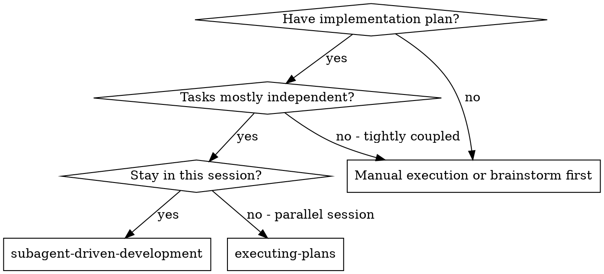

# Subagent-Driven Development

Execute plan by dispatching fresh subagent per task, with two-stage review after each: spec compliance review first, then code quality review.

**Why subagents:** You delegate tasks to specialized agents with isolated context. By precisely crafting their instructions and context, you ensure they stay focused and succeed at their task. They should never inherit your session's context or history — you construct exactly what they need. This also preserves your own context for coordination work.

**Core principle:** Fresh subagent per task + two-stage review (spec then quality) = high quality, fast iteration

## When to Use



**vs. Executing Plans (parallel session):**
- Same session (no context switch)
- Fresh subagent per task (no context pollution)
- Two-stage review after each task: spec compliance first, then code quality
- Faster iteration (no human-in-loop between tasks)

## The Process

```dot
digraph process {
    rankdir=TB;

    subgraph cluster_per_task {
        label="Per Task";
        "Dispatch coding-agent ITC Round 1 (./coding-agent-prompt.md)" [shape=box];
        "Dispatch testing-agent ITC Round 2 (./testing-agent-prompt.md)" [shape=box];
        "ITC agreed? (both ✅)" [shape=diamond];
        "Round 3 or escalate to user" [shape=box];
        "Dispatch implementer subagent (./implementer-prompt.md)" [shape=box];
        "Implementer subagent asks questions?" [shape=diamond];
        "Answer questions, provide context" [shape=box];
        "Implementer subagent implements, tests, commits, self-reviews" [shape=box];
        "Dispatch spec reviewer subagent (./spec-reviewer-prompt.md)" [shape=box];
        "Spec reviewer subagent confirms code matches spec?" [shape=diamond];
        "Implementer subagent fixes spec gaps" [shape=box];
        "Dispatch code quality reviewer subagent (./code-quality-reviewer-prompt.md)" [shape=box];
        "Code quality reviewer subagent approves?" [shape=diamond];
        "Implementer subagent fixes quality issues" [shape=box];
        "Dispatch unit test-runner (./test-runner-task-prompt.md)" [shape=box];
        "Unit tests PASS?" [shape=diamond];
        "Implementer fixes unit failures" [shape=box];
        "Integration tier required? (task ITC tiers_required)" [shape=diamond];
        "Dispatch integration test-runner (./test-runner-task-prompt.md)" [shape=box];
        "Integration tests PASS?" [shape=diamond];
        "Implementer fixes integration failures" [shape=box];
        "Mark task complete in TodoWrite" [shape=box];
    }

    "Read plan, extract all tasks with full text, note context, create TodoWrite" [shape=box];
    "More tasks remain?" [shape=diamond];
    "Dispatch coding-agent Solution ITC Round 1 (./coding-agent-prompt.md)" [shape=box];
    "Dispatch testing-agent Solution ITC Round 2 (./testing-agent-prompt.md)" [shape=box];
    "Solution ITC agreed? (both ✅)" [shape=diamond];
    "Escalate solution ITC to user" [shape=box];
    "Dispatch E2E + full suite test-runner (./test-runner-solution-prompt.md)" [shape=box];
    "E2E + full suite PASS?" [shape=diamond];
    "Implementer fixes E2E failures" [shape=box];
    "Dispatch final code reviewer subagent for entire implementation" [shape=box];
    "Use superpowers:finishing-a-development-branch" [shape=box style=filled fillcolor=lightgreen];

    "Read plan, extract all tasks with full text, note context, create TodoWrite" -> "Dispatch coding-agent ITC Round 1 (./coding-agent-prompt.md)";
    "Dispatch coding-agent ITC Round 1 (./coding-agent-prompt.md)" -> "Dispatch testing-agent ITC Round 2 (./testing-agent-prompt.md)";
    "Dispatch testing-agent ITC Round 2 (./testing-agent-prompt.md)" -> "ITC agreed? (both ✅)";
    "ITC agreed? (both ✅)" -> "Dispatch implementer subagent (./implementer-prompt.md)" [label="yes"];
    "ITC agreed? (both ✅)" -> "Round 3 or escalate to user" [label="no"];
    "Round 3 or escalate to user" -> "Dispatch coding-agent ITC Round 1 (./coding-agent-prompt.md)" [label="round 3: re-dispatch coding-agent with amendments"];
    "Dispatch implementer subagent (./implementer-prompt.md)" -> "Implementer subagent asks questions?";
    "Implementer subagent asks questions?" -> "Answer questions, provide context" [label="yes"];
    "Answer questions, provide context" -> "Dispatch implementer subagent (./implementer-prompt.md)";
    "Implementer subagent asks questions?" -> "Implementer subagent implements, tests, commits, self-reviews" [label="no"];
    "Implementer subagent implements, tests, commits, self-reviews" -> "Dispatch spec reviewer subagent (./spec-reviewer-prompt.md)";
    "Dispatch spec reviewer subagent (./spec-reviewer-prompt.md)" -> "Spec reviewer subagent confirms code matches spec?";
    "Spec reviewer subagent confirms code matches spec?" -> "Implementer subagent fixes spec gaps" [label="no"];
    "Implementer subagent fixes spec gaps" -> "Dispatch spec reviewer subagent (./spec-reviewer-prompt.md)" [label="re-review"];
    "Spec reviewer subagent confirms code matches spec?" -> "Dispatch code quality reviewer subagent (./code-quality-reviewer-prompt.md)" [label="yes"];
    "Dispatch code quality reviewer subagent (./code-quality-reviewer-prompt.md)" -> "Code quality reviewer subagent approves?";
    "Code quality reviewer subagent approves?" -> "Implementer subagent fixes quality issues" [label="no"];
    "Implementer subagent fixes quality issues" -> "Dispatch code quality reviewer subagent (./code-quality-reviewer-prompt.md)" [label="re-review"];
    "Code quality reviewer subagent approves?" -> "Dispatch unit test-runner (./test-runner-task-prompt.md)" [label="yes"];
    "Dispatch unit test-runner (./test-runner-task-prompt.md)" -> "Unit tests PASS?";
    "Unit tests PASS?" -> "Implementer fixes unit failures" [label="FAIL"];
    "Implementer fixes unit failures" -> "Dispatch unit test-runner (./test-runner-task-prompt.md)" [label="re-run"];
    "Unit tests PASS?" -> "Integration tier required? (task ITC tiers_required)" [label="PASS"];
    "Integration tier required? (task ITC tiers_required)" -> "Dispatch integration test-runner (./test-runner-task-prompt.md)" [label="yes"];
    "Dispatch integration test-runner (./test-runner-task-prompt.md)" -> "Integration tests PASS?";
    "Integration tests PASS?" -> "Implementer fixes integration failures" [label="FAIL"];
    "Implementer fixes integration failures" -> "Dispatch integration test-runner (./test-runner-task-prompt.md)" [label="re-run"];
    "Integration tests PASS?" -> "Mark task complete in TodoWrite" [label="PASS"];
    "Integration tier required? (task ITC tiers_required)" -> "Mark task complete in TodoWrite" [label="no"];
    "Mark task complete in TodoWrite" -> "More tasks remain?";
    "More tasks remain?" -> "Dispatch coding-agent ITC Round 1 (./coding-agent-prompt.md)" [label="yes"];
    "More tasks remain?" -> "Dispatch coding-agent Solution ITC Round 1 (./coding-agent-prompt.md)" [label="no"];
    "Dispatch coding-agent Solution ITC Round 1 (./coding-agent-prompt.md)" -> "Dispatch testing-agent Solution ITC Round 2 (./testing-agent-prompt.md)";
    "Dispatch testing-agent Solution ITC Round 2 (./testing-agent-prompt.md)" -> "Solution ITC agreed? (both ✅)";
    "Solution ITC agreed? (both ✅)" -> "Dispatch E2E + full suite test-runner (./test-runner-solution-prompt.md)" [label="yes"];
    "Solution ITC agreed? (both ✅)" -> "Escalate solution ITC to user" [label="no — 3 rounds, no agreement"];
    "Dispatch E2E + full suite test-runner (./test-runner-solution-prompt.md)" -> "E2E + full suite PASS?";
    "E2E + full suite PASS?" -> "Implementer fixes E2E failures" [label="FAIL"];
    "Implementer fixes E2E failures" -> "Dispatch E2E + full suite test-runner (./test-runner-solution-prompt.md)" [label="re-run"];
    "E2E + full suite PASS?" -> "Dispatch final code reviewer subagent for entire implementation" [label="PASS"];
    "Dispatch final code reviewer subagent for entire implementation" -> "Use superpowers:finishing-a-development-branch";
}
```



## ITC Negotiation

Before implementing each task, two agents negotiate an Implementation-Testing Contract (ITC): what will be built and how it will be verified at runtime.

**Why two agents:** A single agent writing its own test contract is subjective. Two agents with opposing incentives force completeness — the coding agent pushes for minimal buildable scope, the testing agent pushes for maximum coverage. Neither can finalize the contract alone.

### Protocol

```
Round 1: coding-agent(task spec + codebase context) → draft ITC
Round 2: testing-agent(task spec + draft ITC)
  → signs ✅: contract locked → write to docs/superpowers/contracts/YYYY-MM-DDTHH-MM-SS-task_itc_N.md and commit
  → lists amendments: proceed to Round 3
Round 3: coding-agent(task spec + testing-agent amendments)
  → accepts amendments + signs ✅: testing-agent re-reviews → if ✅, contract locked
  → disputes with reasoning: escalate to user before proceeding
```

### Contract File Naming

`YYYY-MM-DDTHH-MM-SS-task_itc_N.md` for per-task ITCs.
`YYYY-MM-DDTHH-MM-SS-solution_itc.md` for the solution ITC.

ISO 8601 format with colons replaced by hyphens (filesystem-safe). Lexicographic order = chronological order. Old contracts are never deleted — git history is the audit trail.

### Tier Vocabulary

Task ITC valid tiers: `unit`, `integration` — `unit` is always the minimum.
Solution ITC valid tiers: `e2e`, `full_suite` — these never appear in task ITCs.

### Solution ITC

Negotiated once after all tasks complete, before the E2E harness runs. The coding agent scans the **actual implementation** (not the plan) to produce accurate entry points. The testing agent proposes E2E scenarios and full-suite commands based on what was actually built.

See full contract structure: `docs/superpowers/specs/2026-04-14-e2e-test-harness-design.md`

## Model Selection

Use the least powerful model that can handle each role to conserve cost and increase speed.

**Mechanical implementation tasks** (isolated functions, clear specs, 1-2 files): use a fast, cheap model. Most implementation tasks are mechanical when the plan is well-specified.

**Integration and judgment tasks** (multi-file coordination, pattern matching, debugging): use a standard model.

**Architecture, design, and review tasks**: use the most capable available model.

**Task complexity signals:**
- Touches 1-2 files with a complete spec → cheap model
- Touches multiple files with integration concerns → standard model
- Requires design judgment or broad codebase understanding → most capable model

## Handling Implementer Status

Implementer subagents report one of four statuses. Handle each appropriately:

**DONE:** Proceed to spec compliance review.

**DONE_WITH_CONCERNS:** The implementer completed the work but flagged doubts. Read the concerns before proceeding. If the concerns are about correctness or scope, address them before review. If they're observations (e.g., "this file is getting large"), note them and proceed to review.

**NEEDS_CONTEXT:** The implementer needs information that wasn't provided. Provide the missing context and re-dispatch.

**BLOCKED:** The implementer cannot complete the task. Assess the blocker:
1. If it's a context problem, provide more context and re-dispatch with the same model
2. If the task requires more reasoning, re-dispatch with a more capable model
3. If the task is too large, break it into smaller pieces
4. If the plan itself is wrong, escalate to the human

**Never** ignore an escalation or force the same model to retry without changes. If the implementer said it's stuck, something needs to change.

## Handling Test-Runner Status

Test-runner subagents report one of three statuses: PASS | FAIL | BLOCKED

**PASS:** All commands exited 0 and acceptance criteria are met.
- Unit PASS → check `tiers_required`: if `[unit, integration]`, dispatch integration test-runner; if `[unit]` only, mark task complete
- Integration PASS → mark task complete
- E2E + full suite PASS → proceed to final code review

**FAIL:** Commands ran but tests failed. The code is wrong.
- Extract the `failures` list from the test-runner report
- Dispatch implementer with: original task spec + path to task ITC + exact failure details from report
- Re-dispatch the **same** test-runner after implementer reports DONE
- Do NOT skip the re-run — implementer claims must be independently verified

**BLOCKED:** Commands could not run. The environment is not ready.
- Read `reason` and `resolution` from the test-runner report
- Resolve the environment issue (start missing service, set env var, build frontend, seed DB)
- Re-dispatch the same test-runner — do NOT dispatch the implementer
- BLOCKED is an environment problem, not a code problem

**Never:**
- Proceed past FAIL without re-running the harness after implementer fixes
- Dispatch the implementer in response to BLOCKED (fix the environment instead)
- Renegotiate the ITC because tests are failing (fix the code, not the contract)
- Run integration test-runner before unit tests PASS

## Prompt Templates

**ITC Negotiation:**
- `./coding-agent-prompt.md` — Dispatch coding agent (Round 1 and Round 3)
- `./testing-agent-prompt.md` — Dispatch testing agent (Round 2)

**Implementation and review:**
- `./implementer-prompt.md` — Dispatch implementer subagent
- `./spec-reviewer-prompt.md` — Dispatch spec compliance reviewer subagent
- `./code-quality-reviewer-prompt.md` — Dispatch code quality reviewer subagent

**Test harness:**
- `./test-runner-task-prompt.md` — Dispatch test-runner for unit or integration tier (per task)
- `./test-runner-solution-prompt.md` — Dispatch test-runner for E2E + full suite (solution-level)

## Example Workflow

```
You: I'm using Subagent-Driven Development to execute this plan.

[Read plan file once: docs/superpowers/plans/feature-plan.md]
[Extract all 5 tasks with full text and context]
[Create TodoWrite with all tasks]

Task 1: Hook installation script

[Get Task 1 text and context (already extracted)]
[Dispatch implementation subagent with full task text + context]

Implementer: "Before I begin - should the hook be installed at user or system level?"

You: "User level (~/.config/superpowers/hooks/)"

Implementer: "Got it. Implementing now..."
[Later] Implementer:
  - Implemented install-hook command
  - Added tests, 5/5 passing
  - Self-review: Found I missed --force flag, added it
  - Committed

[Dispatch spec compliance reviewer]
Spec reviewer: ✅ Spec compliant - all requirements met, nothing extra

[Get git SHAs, dispatch code quality reviewer]
Code reviewer: Strengths: Good test coverage, clean. Issues: None. Approved.

[Mark Task 1 complete]

Task 2: Recovery modes

[Get Task 2 text and context (already extracted)]
[Dispatch implementation subagent with full task text + context]

Implementer: [No questions, proceeds]
Implementer:
  - Added verify/repair modes
  - 8/8 tests passing
  - Self-review: All good
  - Committed

[Dispatch spec compliance reviewer]
Spec reviewer: ❌ Issues:
  - Missing: Progress reporting (spec says "report every 100 items")
  - Extra: Added --json flag (not requested)

[Implementer fixes issues]
Implementer: Removed --json flag, added progress reporting

[Spec reviewer reviews again]
Spec reviewer: ✅ Spec compliant now

[Dispatch code quality reviewer]
Code reviewer: Strengths: Solid. Issues (Important): Magic number (100)

[Implementer fixes]
Implementer: Extracted PROGRESS_INTERVAL constant

[Code reviewer reviews again]
Code reviewer: ✅ Approved

[Mark Task 2 complete]

...

[After all tasks]
[Dispatch final code-reviewer]
Final reviewer: All requirements met, ready to merge

Done!
```

## Advantages

**vs. Manual execution:**
- Subagents follow TDD naturally
- Fresh context per task (no confusion)
- Parallel-safe (subagents don't interfere)
- Subagent can ask questions (before AND during work)

**vs. Executing Plans:**
- Same session (no handoff)
- Continuous progress (no waiting)
- Review checkpoints automatic

**Efficiency gains:**
- No file reading overhead (controller provides full text)
- Controller curates exactly what context is needed
- Subagent gets complete information upfront
- Questions surfaced before work begins (not after)

**Quality gates:**
- Self-review catches issues before handoff
- Two-stage review: spec compliance, then code quality
- Review loops ensure fixes actually work
- Spec compliance prevents over/under-building
- Code quality ensures implementation is well-built

**Cost:**
- More subagent invocations (implementer + 2 reviewers per task)
- Controller does more prep work (extracting all tasks upfront)
- Review loops add iterations
- But catches issues early (cheaper than debugging later)

## Red Flags

**Never:**
- Start implementation on main/master branch without explicit user consent
- Skip reviews (spec compliance OR code quality)
- Proceed with unfixed issues
- Dispatch multiple implementation subagents in parallel (conflicts)
- Make subagent read plan file (provide full text instead)
- Skip scene-setting context (subagent needs to understand where task fits)
- Ignore subagent questions (answer before letting them proceed)
- Accept "close enough" on spec compliance (spec reviewer found issues = not done)
- Skip review loops (reviewer found issues = implementer fixes = review again)
- Let implementer self-review replace actual review (both are needed)
- **Start code quality review before spec compliance is ✅** (wrong order)
- Move to next task while either review has open issues
- Skip ITC negotiation because "the task is simple" (every task gets a contract)
- Start implementing before both agents have signed the ITC ✅
- Renegotiate the ITC because tests are failing (fix the code, not the contract)
- Dispatch implementer in response to BLOCKED test-runner (fix the environment instead)
- Proceed past FAIL test-runner without re-running harness after implementer fix
- Run integration test-runner before unit tests PASS
- Forget to write and commit the ITC file to docs/superpowers/contracts/ after negotiation

**If subagent asks questions:**
- Answer clearly and completely
- Provide additional context if needed
- Don't rush them into implementation

**If reviewer finds issues:**
- Implementer (same subagent) fixes them
- Reviewer reviews again
- Repeat until approved
- Don't skip the re-review

**If subagent fails task:**
- Dispatch fix subagent with specific instructions
- Don't try to fix manually (context pollution)

## Integration

**Required workflow skills:**
- **superpowers:using-git-worktrees** - REQUIRED: Set up isolated workspace before starting
- **superpowers:writing-plans** - Creates the plan this skill executes
- **superpowers:requesting-code-review** - Code review template for reviewer subagents
- **superpowers:finishing-a-development-branch** - Complete development after all tasks
- **superpowers:systematic-debugging** - If test-runner returns FAIL repeatedly, use to find root cause before re-dispatching implementer

**Subagents should use:**
- **superpowers:test-driven-development** - Subagents follow TDD for each task

**Alternative workflow:**
- **superpowers:executing-plans** - Use for parallel session instead of same-session execution
