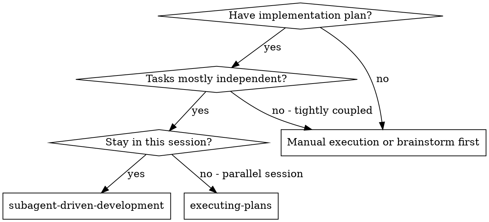

# Subagent-Driven Development

Execute plan by negotiating an ITC (Implementation-Testing Contract) per task, dispatching a fresh implementer subagent, running two-stage review (spec then quality), and verifying with a runtime test harness before marking tasks complete.

**Why subagents:** You delegate tasks to specialized agents with isolated context. By precisely crafting their instructions and context, you ensure they stay focused and succeed at their task. They should never inherit your session's context or history — you construct exactly what they need. This also preserves your own context for coordination work.

**Core principle:** ITC (Implementation-Testing Contract) negotiation before each task + fresh implementer + two-stage review + runtime test harness = verifiable, high-quality iteration

## When to Use



**vs. Executing Plans (parallel session):**
- Same session (no context switch)
- Fresh subagent per task (no context pollution)
- Per-task ITC negotiation (coding-agent + testing-agent) before implementation
- Two-stage review after each task: spec compliance first, then code quality
- Runtime test harness (unit + integration) verifies code actually works before task complete
- Faster iteration (no human-in-loop between tasks)

## The Process

```dot
digraph process {
    rankdir=TB;

    subgraph cluster_per_task {
        label="Per Task";
        "Dispatch coding-agent ITC (./coding-agent-prompt.md)" [shape=box];
        "Dispatch testing-agent ITC (./testing-agent-prompt.md)" [shape=box];
        "ITC agreed? (both ✅)" [shape=diamond];
        "Rounds 3–5 or escalate to user" [shape=box];
        "Escalate task ITC to user" [shape=box];
        "Dispatch implementer subagent (./implementer-prompt.md)" [shape=box];
        "Implementer subagent asks questions?" [shape=diamond];
        "Answer questions, provide context" [shape=box];
        "Implementer subagent implements, tests, commits, self-reviews" [shape=box];
        "Dispatch spec reviewer subagent (./spec-reviewer-prompt.md)" [shape=box];
        "Spec reviewer subagent confirms code matches spec?" [shape=diamond];
        "Implementer subagent fixes spec gaps" [shape=box];
        "Dispatch code quality reviewer subagent (./code-quality-reviewer-prompt.md)" [shape=box];
        "Code quality reviewer subagent approves?" [shape=diamond];
        "Implementer subagent fixes quality issues" [shape=box];
        "Dispatch unit test-runner (./test-runner-task-prompt.md)" [shape=box];
        "Unit tests PASS?" [shape=diamond];
        "Implementer fixes unit failures" [shape=box];
        "Integration tier required? (task ITC tiers_required)" [shape=diamond];
        "Dispatch integration test-runner (./test-runner-task-prompt.md)" [shape=box];
        "Integration tests PASS?" [shape=diamond];
        "Implementer fixes integration failures" [shape=box];
        "Mark task complete in TodoWrite" [shape=box];
    }

    "Read plan, extract all tasks with full text, note context, create TodoWrite" [shape=box];
    "More tasks remain?" [shape=diamond];
    "Dispatch coding-agent Solution ITC Round 1 (./coding-agent-prompt.md)" [shape=box];
    "Dispatch testing-agent Solution ITC Round 2 (./testing-agent-prompt.md)" [shape=box];
    "Solution ITC agreed? (both ✅)" [shape=diamond];
    "Solution Rounds 3–5 or escalate to user" [shape=box];
    "Escalate solution ITC to user" [shape=box];
    "Dispatch E2E + full suite test-runner (./test-runner-solution-prompt.md)" [shape=box];
    "E2E + full suite PASS?" [shape=diamond];
    "Implementer fixes E2E failures" [shape=box];
    "Dispatch final code reviewer subagent for entire implementation" [shape=box];
    "Use superpowers:finishing-a-development-branch" [shape=box style=filled fillcolor=lightgreen];

    "Read plan, extract all tasks with full text, note context, create TodoWrite" -> "Dispatch coding-agent ITC (./coding-agent-prompt.md)";
    "Dispatch coding-agent ITC (./coding-agent-prompt.md)" -> "Dispatch testing-agent ITC (./testing-agent-prompt.md)";
    "Dispatch testing-agent ITC (./testing-agent-prompt.md)" -> "ITC agreed? (both ✅)";
    "ITC agreed? (both ✅)" -> "Dispatch implementer subagent (./implementer-prompt.md)" [label="yes"];
    "ITC agreed? (both ✅)" -> "Rounds 3–5 or escalate to user" [label="no"];
    "Rounds 3–5 or escalate to user" -> "Dispatch coding-agent ITC (./coding-agent-prompt.md)" [label="re-dispatch coding-agent with amendments (rounds 3, 5)"];
    "Rounds 3–5 or escalate to user" -> "Escalate task ITC to user" [label="5 rounds, no agreement"];
    "Dispatch implementer subagent (./implementer-prompt.md)" -> "Implementer subagent asks questions?";
    "Implementer subagent asks questions?" -> "Answer questions, provide context" [label="yes"];
    "Answer questions, provide context" -> "Dispatch implementer subagent (./implementer-prompt.md)";
    "Implementer subagent asks questions?" -> "Implementer subagent implements, tests, commits, self-reviews" [label="no"];
    "Implementer subagent implements, tests, commits, self-reviews" -> "Dispatch spec reviewer subagent (./spec-reviewer-prompt.md)";
    "Dispatch spec reviewer subagent (./spec-reviewer-prompt.md)" -> "Spec reviewer subagent confirms code matches spec?";
    "Spec reviewer subagent confirms code matches spec?" -> "Implementer subagent fixes spec gaps" [label="no"];
    "Implementer subagent fixes spec gaps" -> "Dispatch spec reviewer subagent (./spec-reviewer-prompt.md)" [label="re-review"];
    "Spec reviewer subagent confirms code matches spec?" -> "Dispatch code quality reviewer subagent (./code-quality-reviewer-prompt.md)" [label="yes"];
    "Dispatch code quality reviewer subagent (./code-quality-reviewer-prompt.md)" -> "Code quality reviewer subagent approves?";
    "Code quality reviewer subagent approves?" -> "Implementer subagent fixes quality issues" [label="no"];
    "Implementer subagent fixes quality issues" -> "Dispatch code quality reviewer subagent (./code-quality-reviewer-prompt.md)" [label="re-review"];
    "Code quality reviewer subagent approves?" -> "Dispatch unit test-runner (./test-runner-task-prompt.md)" [label="yes"];
    "Dispatch unit test-runner (./test-runner-task-prompt.md)" -> "Unit tests PASS?";
    "Unit tests PASS?" -> "Implementer fixes unit failures" [label="FAIL"];
    "Implementer fixes unit failures" -> "Dispatch unit test-runner (./test-runner-task-prompt.md)" [label="re-run"];
    "Unit tests PASS?" -> "Integration tier required? (task ITC tiers_required)" [label="PASS"];
    "Integration tier required? (task ITC tiers_required)" -> "Dispatch integration test-runner (./test-runner-task-prompt.md)" [label="yes"];
    "Dispatch integration test-runner (./test-runner-task-prompt.md)" -> "Integration tests PASS?";
    "Integration tests PASS?" -> "Implementer fixes integration failures" [label="FAIL"];
    "Implementer fixes integration failures" -> "Dispatch integration test-runner (./test-runner-task-prompt.md)" [label="re-run"];
    "Integration tests PASS?" -> "Mark task complete in TodoWrite" [label="PASS"];
    "Integration tier required? (task ITC tiers_required)" -> "Mark task complete in TodoWrite" [label="no"];
    "Mark task complete in TodoWrite" -> "More tasks remain?";
    "More tasks remain?" -> "Dispatch coding-agent ITC (./coding-agent-prompt.md)" [label="yes"];
    "More tasks remain?" -> "Dispatch coding-agent Solution ITC Round 1 (./coding-agent-prompt.md)" [label="no"];
    "Dispatch coding-agent Solution ITC Round 1 (./coding-agent-prompt.md)" -> "Dispatch testing-agent Solution ITC Round 2 (./testing-agent-prompt.md)";
    "Dispatch testing-agent Solution ITC Round 2 (./testing-agent-prompt.md)" -> "Solution ITC agreed? (both ✅)";
    "Solution ITC agreed? (both ✅)" -> "Dispatch E2E + full suite test-runner (./test-runner-solution-prompt.md)" [label="yes"];
    "Solution ITC agreed? (both ✅)" -> "Solution Rounds 3–5 or escalate to user" [label="no"];
    "Solution Rounds 3–5 or escalate to user" -> "Dispatch coding-agent Solution ITC Round 1 (./coding-agent-prompt.md)" [label="re-dispatch coding-agent with amendments (rounds 3, 5)"];
    "Solution Rounds 3–5 or escalate to user" -> "Escalate solution ITC to user" [label="5 rounds, no agreement"];
    "Dispatch E2E + full suite test-runner (./test-runner-solution-prompt.md)" -> "E2E + full suite PASS?";
    "E2E + full suite PASS?" -> "Implementer fixes E2E failures" [label="FAIL"];
    "Implementer fixes E2E failures" -> "Dispatch E2E + full suite test-runner (./test-runner-solution-prompt.md)" [label="re-run"];
    "E2E + full suite PASS?" -> "Dispatch final code reviewer subagent for entire implementation" [label="PASS"];
    "Dispatch final code reviewer subagent for entire implementation" -> "Use superpowers:finishing-a-development-branch";
}
```



## Tier-Aware Dispatch

Each task in a plan carries an inline YAML `tier` block (see `skills/writing-plans/SKILL.md` and `skills/writing-plans/tier-rubric.md`). The orchestrator MUST read the tier per task and run only the gates that tier requires.

### Reading the tier

For each task, parse the YAML block immediately following the task header:

```yaml
tier: <trivial | standard | heavy>
tier_reason: "<rubric clause id and explanation>"
```

**fail-safe rules — when in doubt, treat the task as `heavy`:**
- No tier block present → treat as `heavy`. Log a warning naming the task.
- YAML parse error → treat as `heavy`. Log a warning with the parse error and task id.
- `tier` value is not one of `trivial | standard | heavy` → treat as `heavy`. Log a warning naming the task and the unknown value.
- The user may hand-edit `tier` in `plan.md`; the orchestrator trusts the file as the source of truth at execution time and does NOT re-validate against the rubric.

### Per-tier flows

The flows below replace the per-task block of the main process flowchart for every task. The flowchart's solution-level negotiation, E2E + full-suite test-runner, and final code reviewer (after all tasks complete) are unchanged.

### Trivial flow

1. Dispatch implementer subagent (`./implementer-prompt.md`) with task spec + scene-setting context.
2. Handle implementer status (`DONE`, `DONE_WITH_CONCERNS`, `BLOCKED`, `NEEDS_CONTEXT`, `ESCALATE`) per the existing `## Handling Implementer Status` and `## Escalation Handling` rules.
3. On `DONE`: mark task complete in TodoWrite. Skip ITC negotiation, spec-reviewer, code-reviewer, and test-runner — none apply at trivial.

### Standard flow

1. Dispatch implementer subagent (`./implementer-prompt.md`).
2. On `DONE`: dispatch code quality reviewer subagent (`./code-quality-reviewer-prompt.md`).
3. On reviewer ✅: dispatch unit test-runner (`./test-runner-task-prompt.md`) restricted to existing tests (do not require new tests for the change).
4. On test-runner `PASS`: mark task complete.
5. Skip ITC negotiation and spec-reviewer — neither applies at standard.

### Heavy flow

Run the full per-task block exactly as the main process flowchart describes:

1. ITC negotiation (coding-agent ↔ testing-agent, up to 5 rounds, write contract file).
2. Dispatch implementer subagent (`./implementer-prompt.md`) with: task spec + full ITC (Implementation-Testing Contract) (paste complete contract file contents inline — all fields) + scene-setting context.
3. Dispatch spec-reviewer subagent (`./spec-reviewer-prompt.md`) with: task spec + full ITC (Implementation-Testing Contract) (paste complete contract file contents inline — all fields) + implementer report.
4. Code quality reviewer subagent.
5. Unit test-runner; integration test-runner if `tiers_required` includes `integration`.

### Dispatch decision (pseudocode)

```
for task in plan.tasks:
    tier = parse_tier_block(task) or "heavy"   # fail-safe
    match tier:
        case "trivial": run_trivial_flow(task)
        case "standard": run_standard_flow(task)
        case "heavy":    run_heavy_flow(task)
```

## Escalation Handling

Implementer subagents may exit with `ESCALATE` (see `./implementer-prompt.md`). The escalation contract: implementer halts before committing, discards any partial work, and returns a structured `<ESCALATE>` block as the first content of its reply.

### Detecting an escalation

After the implementer returns, check whether the reply begins with `<ESCALATE>`:

- If yes → handle per this section. Do NOT run any further gates for this dispatch attempt.
- If no → process the reply per `## Handling Implementer Status` (DONE, DONE_WITH_CONCERNS, BLOCKED, NEEDS_CONTEXT).

### Validating the escalation

Parse the YAML inside the `<ESCALATE>` block. Reject the escalation (and halt the plan with a clear user message) if any of the following is true:

- `requested_tier` is not strictly higher than `current_tier` (one-way only — never demote).
- `current_tier` is `heavy` (heavy is the top tier; nothing higher exists).
- The task's `escalation_count` is already `1` (per-task cap reached).

When rejecting because `current_tier` is `heavy` or because the cap is reached, surface a user-facing message naming the task id and the reason, then halt.

### Re-dispatching at the new tier

If validation passes:

1. Update `plan.md` for the task (audit trail):
   - `tier` ← `requested_tier`
   - `tier_reason` ← `"escalated from <current_tier>: <reason>"`
   - `escalation_count` ← previous + 1 (start at 0; absent treated as 0)
2. Append the escalation note (full `<ESCALATE>` payload) to the in-memory escalation ledger for the run.
3. **fresh re-dispatch at the new tier — same call as a first dispatch.** Do NOT inject the escalation note into the new flow's prompt. The task description in `plan.md` is the source of truth; the escalation note is audit-only.

### End-of-run escalation ledger

After the last task in the plan completes (or the plan halts), append the ledger to `plan.md` if any escalations occurred:

```markdown
## Escalations (<count>)

- T<id>: <original_tier> → <new_tier>. Reason: <reason>. Rubric clause violated: <clause id>.
- T<id>: <original_tier> → <new_tier>. Reason: <reason>. Rubric clause violated: <clause id>.
```

If no escalations occurred during the run, do not append the section.

### Caps and guardrails

| Rule | Value |
|---|---|
| Max escalations per task | 1 (orchestrator enforces) |
| Plan-wide escalation budget | none (per-task cap is the only cap) |
| `heavy` may not escalate | enforced — heavy escalation halts the plan |
| Demotion at runtime | forbidden — escalation is one-way only |
| Partial work on escalate | discarded by implementer; orchestrator does NOT inject the escalation note into the re-dispatched prompt |

## ITC Negotiation

Before implementing each task, two agents negotiate an Implementation-Testing Contract (ITC): what will be built and how it will be verified at runtime.

**Why two agents:** A single agent writing its own test contract is subjective. Two agents with opposing incentives force completeness — the coding agent pushes for minimal buildable scope, the testing agent pushes for maximum coverage. Neither can finalize the contract alone.

### Protocol

```
Round 1: coding-agent(task spec + codebase context) → draft ITC
Round 2: testing-agent(task spec + Round 1 draft ITC)
  → signs ✅: contract locked → write to docs/superpowers/contracts/<YYYY-MM-DD-feature-name>/YYYY-MM-DDTHH-MM-SS-task_itc_N.md and commit
  → lists amendments: proceed to Round 3
Round 3: coding-agent(task spec + own Round 1 draft ITC + testing-agent Round 2 amendments)
  → accepts amendments + signs ✅: testing-agent re-reviews → if ✅, contract locked
  → disputes with reasoning: proceed to Round 4
Round 4: testing-agent(task spec + own Round 2 amendments + coding-agent Round 3 response)
  → signs ✅: contract locked
  → lists amendments: proceed to Round 5
Round 5: coding-agent(task spec + own Round 3 response + testing-agent Round 4 amendments) — final round
  → accepts amendments + signs ✅: testing-agent re-reviews → if ✅, contract locked
  → still disputes: escalate to user before proceeding
```

### Contract File Naming

All contracts for a plan live in a feature sub-folder:
`docs/superpowers/contracts/<YYYY-MM-DD-feature-name>/`

- `YYYY-MM-DD` = plan start date; `feature-name` = kebab-case slug of the feature
- Sub-folder is created when the first contract for the plan is written
- All task ITCs and the solution ITC for the same plan go into the same sub-folder

File names inside the sub-folder:
- `YYYY-MM-DDTHH-MM-SS-task_itc_N.md` for per-task ITCs
- `YYYY-MM-DDTHH-MM-SS-solution_itc.md` for the solution ITC

ISO 8601 format with colons replaced by hyphens (filesystem-safe). Lexicographic order = chronological order. Old contracts are never deleted — git history is the audit trail.

### Tier Vocabulary

Task ITC valid tiers: `unit`, `integration` — `unit` is always the minimum.
Solution ITC valid tiers: `e2e`, `full_suite` — these never appear in task ITCs.

### Solution ITC

Negotiated once after all tasks complete, before the E2E harness runs.

**Required inputs** (load all three before dispatching Round 1):
1. `docs/superpowers/specs/<date>-<topic>-journeys.yaml` — authoritative journey list, produced at brainstorm time.
2. `skills/subagent-driven-development/testing-strategies.md` — the canonical strategy playbook.
3. The actual implementation (coding agent scans the codebase, not the plan).

**Output shape:** the signed solution ITC contains a `coverage_matrix` whose rows are journey IDs and whose columns are strategy IDs from the playbook. Every cell is either a `scenario` (with `command` and `assertion_shape`) or an `na` (with non-empty justification). Free-form `scenarios:` lists are no longer valid.

**Protocol:** same five-round negotiation alternating between coding-agent (odd rounds) and testing-agent (even rounds) up to Round 5. The flowchart's escalation arc represents the terminal case (5 rounds without agreement).

**Post-negotiation gate (before dispatching the solution test-runner):**
Verify the signed ITC's `coverage_matrix` has:
- A row for every journey in journeys.yaml.
- A column for every strategy ID in testing-strategies.md.
- A non-empty `scenario` or `na` value in every cell.

If any row, column, or cell is missing, reject and re-dispatch Round 1.

See full design: `docs/superpowers/specs/2026-04-20-e2e-coverage-matrix-design.md`

## Model Selection

Use the least powerful model that can handle each role to conserve cost and increase speed.

**Mechanical implementation tasks** (isolated functions, clear specs, 1-2 files): use a fast, cheap model. Most implementation tasks are mechanical when the plan is well-specified.

**Integration and judgment tasks** (multi-file coordination, pattern matching, debugging): use a standard model.

**Architecture, design, and review tasks**: use the most capable available model.

**Task complexity signals:**
- Touches 1-2 files with a complete spec → cheap model
- Touches multiple files with integration concerns → standard model
- Requires design judgment or broad codebase understanding → most capable model

## Handling Implementer Status

Implementer subagents report one of five statuses. Handle each appropriately:

**DONE:** Proceed to spec compliance review.

**DONE_WITH_CONCERNS:** The implementer completed the work but flagged doubts. Read the concerns before proceeding. If the concerns are about correctness or scope, address them before review. If they're observations (e.g., "this file is getting large"), note them and proceed to review.

**NEEDS_CONTEXT:** The implementer needs information that wasn't provided. Provide the missing context and re-dispatch.

**BLOCKED:** The implementer cannot complete the task. Assess the blocker:
1. If it's a context problem, provide more context and re-dispatch with the same model
2. If the task requires more reasoning, re-dispatch with a more capable model
3. If the task is too large, break it into smaller pieces
4. If the plan itself is wrong, escalate to the human

**ESCALATE:** The implementer's reply begins with an `<ESCALATE>` YAML block. Process per `## Escalation Handling`. Do NOT proceed to spec or quality review for this dispatch attempt.

**Never** ignore an escalation or force the same model to retry without changes. If the implementer said it's stuck, something needs to change.

## Handling Test-Runner Status

Test-runner subagents report one of three statuses: PASS | FAIL | BLOCKED

**PASS:** All commands exited 0 and acceptance criteria are met.
- Unit PASS → read `tiers_required` from the task ITC file in `docs/superpowers/contracts/<YYYY-MM-DD-feature-name>/`: if `[unit, integration]`, dispatch integration test-runner; if `[unit]` only, mark task complete
- Integration PASS → mark task complete
- E2E + full suite PASS → proceed to final code review

**FAIL:** Commands ran but tests failed. The code is wrong.
- Extract the `failures` list from the test-runner report
- Dispatch implementer with: original task spec + path to task ITC + exact failure details from report
- Re-dispatch the **same** test-runner after implementer reports DONE
- Do NOT skip the re-run — implementer claims must be independently verified

**BLOCKED:** Commands could not run. The environment is not ready.
- Read `reason` and `resolution` from the test-runner report
- Assess whether you can resolve the issue yourself:
  - **Resolve autonomously** if the fix is a runnable command you can execute safely — e.g. `npm run build`, starting a local test server, running a seed script
  - **Escalate to the user** for issues you cannot handle yourself — env vars requiring credentials or secrets, external service configuration, complex or destructive operations, anything requiring human judgment
- After resolving (or after the user confirms resolution), re-dispatch the same test-runner
- Do NOT dispatch the implementer — BLOCKED is an environment problem, not a code problem

**Never:**
- Proceed past FAIL without re-running the harness after implementer fixes
- Dispatch the implementer in response to BLOCKED (resolve the environment or escalate to user instead)
- Attempt to set env vars or configure external services autonomously — escalate to user for those
- Re-dispatch the test-runner without first resolving or getting user confirmation on the BLOCKED issue
- Renegotiate the ITC because tests are failing (fix the code, not the contract)
- Run integration test-runner before unit tests PASS

## Prompt Templates

**ITC Negotiation:**
- `./coding-agent-prompt.md` — Dispatch coding agent (Round 1 and Round 3)
- `./testing-agent-prompt.md` — Dispatch testing agent (Round 2)

**Implementation and review:**
- `./implementer-prompt.md` — Dispatch implementer subagent
- `./spec-reviewer-prompt.md` — Dispatch spec compliance reviewer subagent
- `./code-quality-reviewer-prompt.md` — Dispatch code quality reviewer subagent

**Test harness:**
- `./test-runner-task-prompt.md` — Dispatch test-runner for unit or integration tier (per task)
- `./test-runner-solution-prompt.md` — Dispatch test-runner for E2E + full suite (solution-level)

## Example Workflow

```
You: I'm using Subagent-Driven Development to execute this plan.

[Read plan file once: docs/superpowers/plans/feature-plan.md]
[Extract all 5 tasks with full text and context]
[Create TodoWrite with all tasks]

Task 1: Hook installation script

[Get Task 1 text and context (already extracted)]

[Dispatch coding-agent ITC Round 1 — task spec + existing hooks/ directory context]
Coding agent: Proposes test_contract with tiers_required: [unit], 2 test commands.
              Rationale: no external services, pure filesystem writes.
              coding_agent: ✅

[Dispatch testing-agent ITC Round 2 — task spec + coding agent's draft]
Testing agent: ✅ Spec compliant — commands target specific files, must_cover includes
               idempotent install and --force flag behavior.

[Write docs/superpowers/contracts/2026-04-14-hook-installation/2026-04-14T14-30-00-task_itc_1.md and commit]

[Dispatch implementation subagent with full task text + context + ITC path]

Implementer: "Before I begin - should the hook be installed at user or system level?"

You: "User level (~/.config/superpowers/hooks/)"

Implementer: "Got it. Implementing now..."
[Later] Implementer:
  - Implemented install-hook command
  - Added tests, 5/5 passing
  - Self-review: Found I missed --force flag, added it
  - Committed

[Dispatch spec compliance reviewer]
Spec reviewer: ✅ Spec compliant - all requirements met, nothing extra

[Get git SHAs, dispatch code quality reviewer]
Code reviewer: Strengths: Good test coverage, clean. Issues: None. Approved.

[Dispatch unit test-runner — commands from task ITC]
Test runner:
  Status: PASS
  Results:
    - command: "npm test -- tests/install-hook.test.js"
      status: PASS
      summary: "5/5 tests passed"

[task ITC tiers_required: [unit] — skip integration harness]

[Mark Task 1 complete]

Task 2: Recovery modes

[Get Task 2 text and context (already extracted)]

[Dispatch coding-agent ITC Round 1 — task spec + codebase context]
Coding agent: Proposes tiers_required: [unit, integration].
              Rationale: recovery modes write to and read from the index DB.
              coding_agent: ✅

[Dispatch testing-agent ITC Round 2 — task spec + coding agent's draft]
Testing agent: ✅ Approved — commands target specific files, required_services lists the test DB.

[Write docs/superpowers/contracts/2026-04-14-hook-installation/2026-04-14T14-32-00-task_itc_2.md and commit]

[Dispatch implementation subagent with full task text + context + ITC path]

Implementer: [No questions, proceeds]
Implementer:
  - Added verify/repair modes
  - 8/8 tests passing
  - Self-review: All good
  - Committed

[Dispatch spec compliance reviewer]
Spec reviewer: ❌ Issues:
  - Missing: Progress reporting (spec says "report every 100 items")
  - Extra: Added --json flag (not requested)

[Implementer fixes issues]
Implementer: Removed --json flag, added progress reporting

[Spec reviewer reviews again]
Spec reviewer: ✅ Spec compliant now

[Dispatch code quality reviewer]
Code reviewer: Strengths: Solid. Issues (Important): Magic number (100)

[Implementer fixes]
Implementer: Extracted PROGRESS_INTERVAL constant

[Code reviewer reviews again]
Code reviewer: ✅ Approved

[Dispatch unit test-runner — commands from task ITC]
Test runner:
  Status: PASS
  Results:
    - command: "npm test -- src/recovery.test.ts"
      status: PASS
      summary: "8/8 tests passed"

[task ITC tiers_required: [unit, integration] — dispatch integration test-runner]

[Dispatch integration test-runner — integration commands from task ITC]
Test runner:
  Status: PASS
  Results:
    - command: "npm test -- tests/integration/recovery.test.ts"
      status: PASS
      summary: "4/4 tests passed"

[Mark Task 2 complete]

...

[After all tasks complete]

[Load docs/superpowers/specs/<date>-<topic>-journeys.yaml and skills/subagent-driven-development/testing-strategies.md]

[Dispatch coding-agent Solution ITC Round 1 — scans actual implementation + journeys.yaml + playbook]
Coding agent: Documents real routes. Produces coverage_matrix with rows per journey,
              columns per strategy (happy_path, negative_path, state_persistence,
              feature_interaction, auth_boundary). Every cell = scenario or justified na.
              coding_agent: ✅

[Dispatch testing-agent Solution ITC Round 2 — draft matrix + journeys.yaml + playbook]
Testing agent: ✅ Approved — matrix complete, no shallow assertion_shapes, na justifications valid.

[Post-negotiation gate: verify matrix has row per journey × column per strategy, no empty cells]

[Write docs/superpowers/contracts/2026-04-14-hook-installation/2026-04-20T16-00-00-solution_itc.md and commit]

[Dispatch E2E + full suite test-runner — coverage_matrix + full_suite command]
Test runner:
  Status: PASS
  matrix_results:
    J1:
      happy_path:          { status: PASS }
      negative_path:       { status: PASS }
      state_persistence:   { status: PASS }
      feature_interaction: { status: PASS }
      auth_boundary:       { status: PASS }
    J2:
      happy_path:          { status: PASS }
      negative_path:       { status: PASS }
      state_persistence:   { status: NA, justification: "Single atomic request, no multi-step state." }
      feature_interaction: { status: PASS }
      auth_boundary:       { status: NA, justification: "Fully public journey, no auth surface." }
  full_suite:
    status: PASS
    summary: "47/47 tests passed"
  overall: PASS

[Dispatch final code reviewer subagent for entire implementation]
Final reviewer: All requirements met, no regressions, ready to merge

Done!
```

## Advantages

**vs. Manual execution:**
- Subagents follow TDD naturally
- Fresh context per task (no confusion)
- Parallel-safe (subagents don't interfere)
- Subagent can ask questions (before AND during work)

**vs. Executing Plans:**
- Same session (no handoff)
- Continuous progress (no waiting)
- Review checkpoints automatic

**Efficiency gains:**
- No file reading overhead (controller provides full text)
- Controller curates exactly what context is needed
- Subagent gets complete information upfront
- Questions surfaced before work begins (not after)

**Quality gates:**
- Self-review catches issues before handoff
- Two-stage review: spec compliance, then code quality
- Runtime test harness: unit tests (always) + integration tests (when task ITC requires)
- E2E harness after all tasks: full user journey verified before final review
- Review loops ensure fixes actually work
- Spec compliance prevents over/under-building
- Code quality ensures implementation is well-built

**Cost:**
- More subagent invocations (implementer + 2 reviewers per task)
- Controller does more prep work (extracting all tasks upfront)
- Review loops add iterations
- But catches issues early (cheaper than debugging later)

## Red Flags

**Never:**
- Start implementation on main/master branch without explicit user consent
- Skip reviews (spec compliance OR code quality)
- Proceed with unfixed issues
- Dispatch multiple implementation subagents in parallel (conflicts)
- Make subagent read plan file (provide full text instead)
- Skip scene-setting context (subagent needs to understand where task fits)
- Ignore subagent questions (answer before letting them proceed)
- Accept "close enough" on spec compliance (spec reviewer found issues = not done)
- Skip review loops (reviewer found issues = implementer fixes = review again)
- Let implementer self-review replace actual review (both are needed)
- **Start code quality review before spec compliance is ✅** (wrong order)
- Move to next task while either review has open issues
- Skip ITC negotiation because "the task is simple" (every task gets a contract)
- Start implementing before both agents have signed the ITC ✅
- Renegotiate the ITC because tests are failing (fix the code, not the contract)
- Dispatch implementer in response to BLOCKED test-runner (resolve environment or escalate to user instead)
- Attempt to set env vars or configure external services autonomously — escalate to user for those
- Proceed past FAIL test-runner without re-running harness after implementer fix
- Run integration test-runner before unit tests PASS
- Forget to write and commit the ITC file to docs/superpowers/contracts/<YYYY-MM-DD-feature-name>/ after negotiation
- Inject the implementer's escalation note into the re-dispatched flow's prompt — escalation notes are audit-only; the next agent reads the task description, not the note
- Demote a task's tier at runtime — escalation is one-way only

**If subagent asks questions:**
- Answer clearly and completely
- Provide additional context if needed
- Don't rush them into implementation

**If reviewer finds issues:**
- Implementer (same subagent) fixes them
- Reviewer reviews again
- Repeat until approved
- Don't skip the re-review

**If subagent fails task:**
- Dispatch fix subagent with specific instructions
- Don't try to fix manually (context pollution)

## Integration

**Required workflow skills:**
- **superpowers:using-git-worktrees** - REQUIRED: Set up isolated workspace before starting
- **superpowers:writing-plans** - Creates the plan this skill executes
- **superpowers:requesting-code-review** - Code review template for reviewer subagents
- **superpowers:finishing-a-development-branch** - Complete development after all tasks
- **superpowers:systematic-debugging** - If test-runner returns FAIL repeatedly, use to find root cause before re-dispatching implementer

**Subagents should use:**
- **superpowers:test-driven-development** - Subagents follow TDD for each task

**Alternative workflow:**
- **superpowers:executing-plans** - Use for parallel session instead of same-session execution
